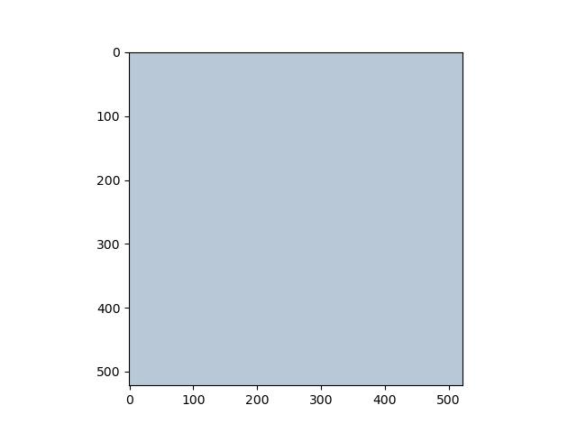
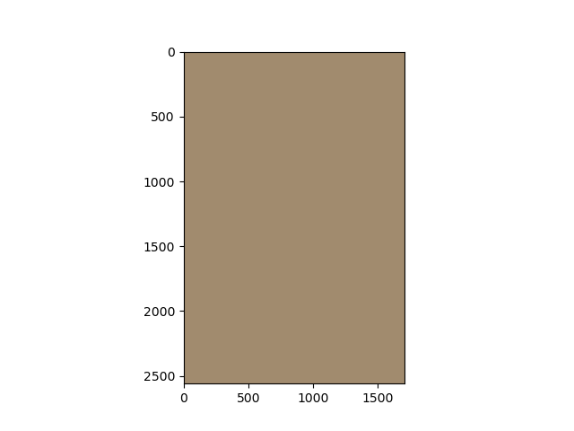
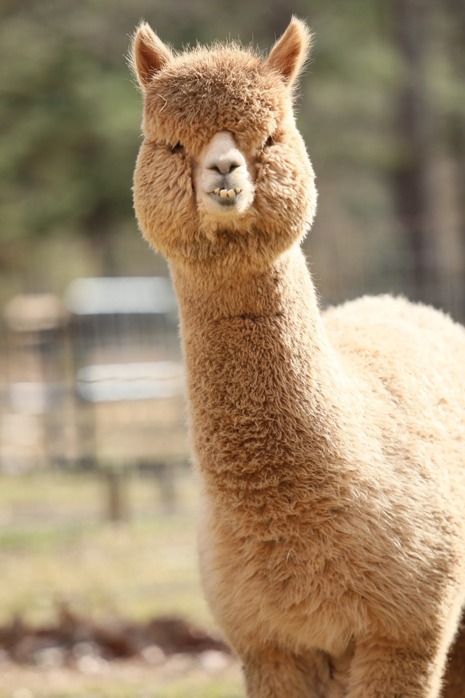
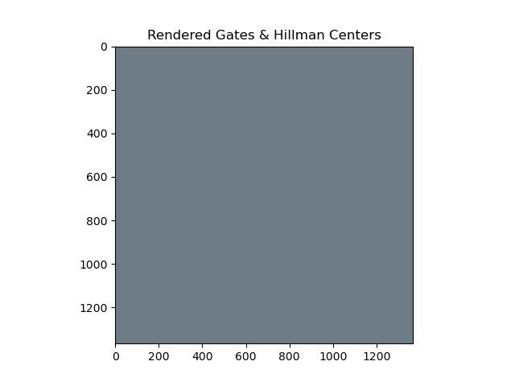
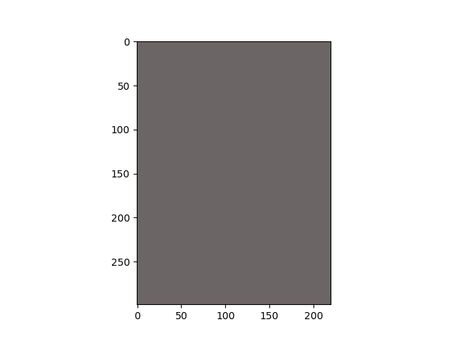
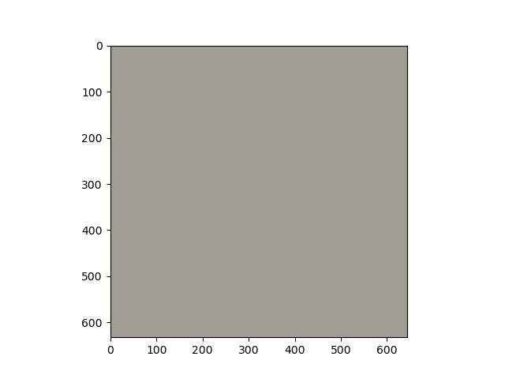
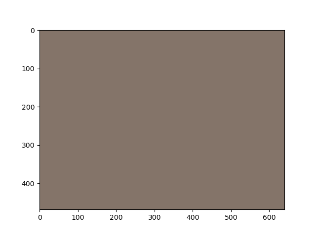
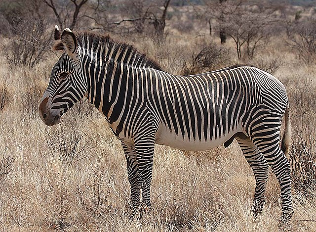
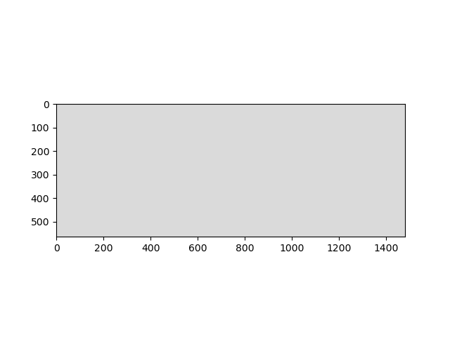
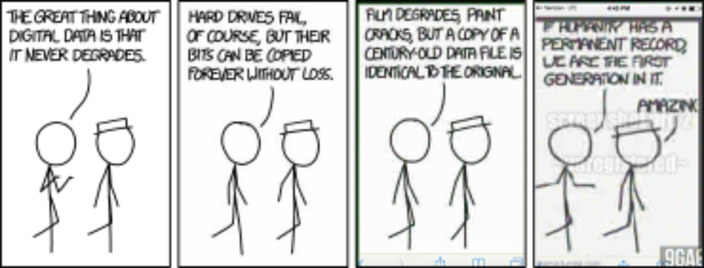

# HHS CS Workshop: Quadtrees
Using quadtrees to make art.  
Inspired by [Michael Fogleman's](https://www.michaelfogleman.com/) cool [repo](https://github.com/fogleman/Quads) on quadtrees.  
A target image is given. A quadtree parent is initialized as one rectangle with the average color of the target image. Every iteration, a quadtree is selected to be split into 4 children quadrants, each consisting of the average color within that quadrant. The quadtree to split is determined by which split reduces the error of the rendered image with the target image the most. 
## Quadtree Object
Contains:
- Rectangle bounds within the image.
- Rendered image within that quadrant and its average color.
- Error within said quadtree with target image and how much error could be reduced if split.
- 4 children quadtrees.
## Examples:
### Frieren:
**Quadtree Rendering:**  

  
Target Image (Click to Expand)

### Alpaca:
**Quadtree Rendering:**  

  
Target Image (Click to Expand)

### Gates and Hillman Centers:
**Quadtree Rendering:**  

  
Target Image (Click to Expand)

### Obama:
**Quadtree Rendering:**  

  
Target Image (Click to Expand)

### Mr. Shelby:
**Quadtree Rendering:**  

  
Target Image (Click to Expand)

### Zebra:
**Quadtree Rendering:**  

  
Target Image (Click to Expand)

### XKCD Comic #1683:
**Quadtree Rendering:**  

  
Target Image (Click to Expand)

